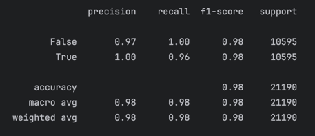

# Puppeteers

# Кейс "Выявление нетипичных операций по транзакционной активности"

## 1. [clear.ipynb](clear.ipynb) - Очистка данных

## 2. [model.ipynb](model.ipynb) - Содержит код создания модели ML

### 1.2 [use_model.py](use_model.py) - При вызове use_model(путь_к_тест_файлу) будет использована ML модель для поиска нетипичных транзакций после чего результат будет сохранен в файл "preds_use_model.csv"

## 3. [EDA.ipynb](EDA.ipynb) - Исследовательский анализ данных

## 4. [anomaly.ipynb](anomaly.ipynb) - Паттерны поведения (пункт 3 и 4 из ТЗ)

### 4.1 [map.html](map.html) - Карта местоположения откуда происходила подозрительная активность

# Алгоритм создания модели

### 1. Предобработка категориальных данных: 
   Для категориальных признаков выполняется преобразование редких значений в категорию "SMALL" (если встречаются редко,
   меньше заданного порога).
   Затем каждый категориальный столбец кодируется с помощью меток (Label Encoding).
    
    
### 2. Обнаружение аномалий: 
   Каждый из методов оценивает аномальности, присваивая значения, которые затем комбинируются для финального списка
   аномальных данных.
   Для поиска аномалий используются три алгоритма:
    3. Isolation Forest
    4. Local Outlier Factor (LOF)
    5. Elliptic Envelope.
        
        

### 3. Создание метки для аномалий: 
   На основе решений всех алгоритмов создается бинарная метка анomaly для каждой строки данных.
    
    

### 4. Балансировка классов: 
   Для обучения модели на основе меток аномалий используется метод SMOTE, который генерирует дополнительные примеры для
   редкого класса (аномальных данных), чтобы сбалансировать классы.
    
    
### 5. Обучение модели классификации: 
   Для классификации аномалий используется CatBoostClassifier, который обучается на сбалансированном наборе данных.
    
    
### 6. Оценка модели: 
   После обучения модель оценивается с помощью метрики classification_report
   